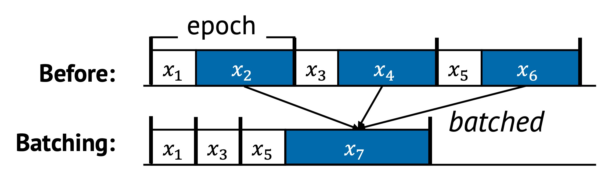

# Batching

Batching is a technique that combines multiple tasks into a single grouped
operation. Instead of processing each task individually, the system handles them
together, reducing duplicated overhead and improving resource efficiency.

This is one of the most widely used methods in performance-critical systems, as
it directly reduces the number of operations executed and enables further
optimizations like deferring, caching, and reordering.

## 1. Definition with Visual Example

Batching replaces multiple individual operations with a single composite task.
Below is a visual example of how batching transforms a task sequence.

In the original sequence:
- Tasks $x_2$, $x_4$, and $x_6$ are repeated across epochs
- These incur repeated costs during each iteration

After batching:
- Redundant steps are merged into a new task $x_7$
- The sequence becomes shorter and more efficient
- Tasks $x_2$, $x_4$, and $x_6$ are removed or replaced

## 2. Underlying Principles

Batching leverages all three core principles of sequential optimization:

- **Removal**: Discards duplicated or redundant tasks such as stale writes or repeated validations
- **Replacement**: Combines tasks into one (e.g., replacing multiple flushes with a single commit)
- **Reordering**: Alters task order to group similar operations together and improve data locality

These effects often happen simultaneously during batching, making it a powerful
and multidimensional technique.

## 3. Conditions for Batching

Batching is beneficial when the following condition holds:

$$
\text{len}(S_{\text{before}}) > \text{len}(S_{\text{after}}) \quad \text{and} \quad F(x_2) + F(x_4) + F(x_6) > F(x_7)
$$

This means:
- The batched sequence has fewer tasks
- The combined runtime of the individual tasks is greater than the cost of the batch operation

## 4. When to Apply

Batching is effective in several scenarios:

### Coalesced Calls

This is common when each individual call is expensive due to fixed setup or
context-switching costs. In such cases, batching provides an opportunity to
amortize that cost over multiple tasks.

For example, a Direct Memory Access (DMA) operation has a fixed setup cost and a
per-byte transfer cost. If each DMA is invoked separately, the fixed overhead
is paid every time. But by batching multiple DMAs into one large operation, the
setup cost is incurred only once.

This concept generalizes to many other operations:
- Remote Procedure Calls (RPCs)
- System calls
- GPU kernel launches
- Disk I/O flushes
- Network packet transmission

All of these benefit from batching when there's non-trivial per-task
overhead. Without batching, this cost is redundantly paid in every epoch
or iteration.
With batching, the system executes a combined operation that eliminates
repeated overhead and improves throughput.

### Discard Stale Tasks at the Time of Batched Request

In many systems, updates to state happen rapidly and repeatedly. When batching
is applied, some operations may become unnecessary by the time the batch is
processed.

This allows the system to skip redundant work.

For example, a write buffer may receive multiple writes to the same file block.
By the time the batch is flushed to disk, only the most recent update needs
to be committed — earlier writes can be discarded.

This behavior leads to two benefits:
- Reduces wasted I/O or CPU cycles
- Shortens the effective task sequence by applying *removal*

It’s especially valuable in scenarios where tasks invalidate or
overwrite each other within short time spans, such as key-value store
updates or configuration writes.

### Improve Spatial and Temporal Locality

Batching naturally groups related tasks. This reordering effect improves how
data is accessed in memory or on hardware queues.

For example:
- Reading or writing adjacent memory addresses can reduce cache misses.
- Grouping I/O by file block or sector reduces seek and write amplification.
- Batching packets in a network stack improves CPU cache and queue efficiency.

Even when tasks aren't logically related, reordering them through batching
can uncover new locality opportunities the original sequence could not take
advantage of.

## 5. Examples from Real Systems

| System | Description |
|--------|-------------|
| [NEVE (SOSP'17)](https://dl.acm.org/doi/10.1145/3132747.3132754) | Coalesce and defer traps to the hypervisor by logging to avoid context switch overhead between a VM and the hypervisor.|
| [EAW (SOSP'13)](https://dl.acm.org/doi/10.1145/2517349.2522724) | Exclude outdated data from the batch by allowing modifications in the log before committin.|
| [IX (OSDI'14)](https://dl.acm.org/doi/10.5555/2685048.2685053) | Apply batching at every stage of the network stack, including system calls and hardware queues to enhance instruction and data locality. |

## Additional Notes

- Batching is often closely tied to **deferring**. Tasks are delayed until a batch threshold is reached.
- Batching often enables better **caching**, by grouping operations accessing similar memory regions.
- Batching **increase latency** for the first tasks in a batch, so it's important to balance throughput with responsiveness.

---

Up next: [Caching →](./caching.md)
