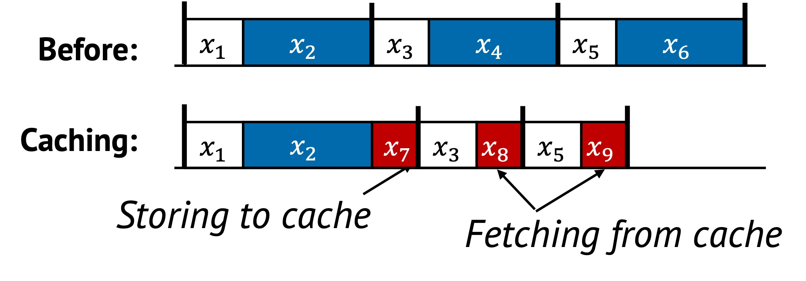

# Caching

Caching is a technique that stores the result of a previously completed task, so
that it can be reused when the same computation or data access is needed again.
Instead of repeating work, the system retrieves a saved result, thereby reducing
runtime and redundant effort.

While batching eliminates repeated work across tasks in the same epoch, caching
focuses on *redundant work across time*---reusing results across multiple
epochs, requests, or executions.

## 1. Definition with Visual Example

Caching replaces repeated computation or access with a cheaper lookup task.

For example:
- Without caching, computing a result (e.g., permission checks, network routing) happens every time.
- With caching, the result is stored and reused if the input or access pattern matches.

Caching is particularly effective when the same task appears repeatedly in
sequential execution, especially across multiple epochs.

In this example:
- The original execution repeats $x_2$, $x_4$, and $x_6$ every epoch.
- Caching first executes $x_2$ and stores its result as $x_7$. This $x_7$ represents the additional cost of caching (e.g., writing to memory).
- Later, instead of re-computing $x_4$ and $x_6$, the system performs simple lookups, represented as $x_8$ and $x_9$.
- These lookups are significantly cheaper than the original computations.

By avoiding full re-execution of $x_4$ and $x_6$, caching saves total runtime
across epochs---as long as the caching overhead ($x_7$, $x_8$, $x_9$) is less
than the cost of the original tasks.

## 2. Underlying Principles

Caching primarily applies the **replacement** principle by substituting repeated computations with cheaper lookups.

## 3. Conditions for Effective Caching

Caching is effective when:

$$
F(x_4) + F(x_6) > F(x_7) + F(x_8) + F(x_9)
$$

Where:
- $F(x_4)$, $F(x_6)$ are original task costs
- $F(x_7)$ is the cost to populate the cache
- $F(x_8)$, $F(x_9)$ are the cost of retrieving cached results

Caching should only be used when:
- The overhead of maintaining the cache is *less than* the cost of repeated computation
- There is a high chance of reuse (temporal locality)

## 4. When to Apply

From our analysis, we observed three common ways caching is applied in real
systems. These reflect where and how caching is introduced to maximize reuse and
reduce redundant computation.

### 1. Introducing a New Caching Layer
This is the most straightforward approach. A caching layer is added on top of an
existing system or component to intercept expensive operations.
For example, adding a read cache to a file system improves performance by
avoiding repeated disk reads.

This technique works well when:
- The system’s logic is stable and cacheable
- Repeated accesses happen at a higher layer (e.g., middleware, clients)

By layering caching externally, performance improves without modifying core logic.

### 2. Modifying the System to Expose Reuse

Sometimes, caching opportunities are hidden because the system’s structure
doesn't separate reusable computations from non-reusable ones. In these cases,
modifying the internal logic can make reuse more explicit and accessible.

For example, decoupling permission checks from directory lookups[^note] allows the
system to cache the result of permission validation independently, even if the
path structure changes. Similarly, separating expensive parsing from request
routing enables selective caching of parsed metadata.

[^note]: Chia-Che Tsai, Yang Zhan, Jayashree Reddy, Yizheng Jiao, Tao Zhang, and Donald E. Porter. 2015. How to get more value from your file system directory cache. In Proceedings of the 25th Symposium on Operating Systems Principles (SOSP '15). Association for Computing Machinery, New York, NY, USA, 441–456. https://doi.org/10.1145/2815400.2815405

This approach requires changes to internal components, but it often leads to
finer-grained reuse and better cache hit rates — especially in low-level systems
where performance is critical.

### 3. Designing a Cache Policy
Even with caching in place, performance depends heavily on choosing what to
cache and when. A well-designed cache policy maximizes benefit while minimizing
memory usage and consistency risk.

For example, an LRU (Least Recently Used) policy retains the most frequently
accessed data, which works well in systems with temporal locality. In key-value
stores, selectively caching hot keys based on access frequency improves lookup
latency.

Effective policies often adapt to workload patterns, dynamically adjusting what
is kept in cache and what is evicted, making the difference between helpful and
harmful caching.

---

These three strategies---layering, refactoring, and policy---represent the most
common ways caching is adopted and optimized in real systems. Many
implementations combine them, starting with a layer and then refining reuse and
policies over time.

## 5. Examples from Real Systems

| System | Description |
|--------|-------------|
| [Drizzle (SOSP'17)](https://dl.acm.org/doi/10.1145/3132747.3132750) | Reuse scheduling decisions across micro-batches as computation is largely static and undergoes infrequent changes. |
| [Protean (OSDI'20)](https://www.usenix.org/conference/osdi20/presentation/hadary) | Cache previous virtual machine allocation result and reuse the placement across multiple requests. |
| [Tasi et al. (SOSP'15)](https://dl.acm.org/doi/10.1145/2815400.2815405) | Decouple permission checking from locating a directory and memoizes permission check resuls to enable fast path. |
| [NetCache (SOSP'17)](https://dl.acm.org/doi/10.1145/3132747.3132764) | Uses programmable switches to cache hot items in the network dataplane, reducing latency in key-value lookups. |

## Additional Notes

- Caching is sometimes layered: intermediate layers cache partial results, upper layers cache full responses.
- Managing cache consistency is crucial. Stale or invalid entries can lead to incorrect behavior.
- Eviction policy (e.g., LRU, LFU, TTL) plays a key role in keeping the cache useful and efficient.

---

Up next: [Precomputing →](./precomputing.md)
