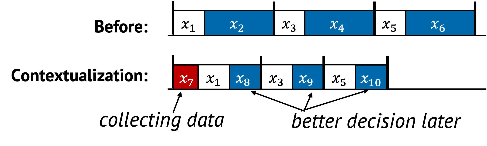

# Contextualization

Contextualization is a performance technique where the system adapts its
behavior based on current runtime conditions. Instead of using the same fixed
plan every time, the system observes its environment and decides how to execute
based on what it sees. This enables more efficient execution by avoiding
unnecessary work or choosing better strategies for each situation.

## 1. Definition with Visual Example

Contextualization changes execution paths based on observed workload, input pattern, or system state.
The system may skip tasks, reorder them, or replace them depending on the available context.

  

In the original sequence, tasks from $x_1$ to $x_6$ are executed the same way in every epoch.
After contextualization, a new decision point $x_7$ is introduced. This task observes the current context and triggers a modified execution plan:

- Some tasks such as $x_2$, $x_4$, and $x_6$ are replaced by $x_8$, $x_9$, and $x_{10}$
- Other tasks like $x_1$, $x_3$, and $x_5$ are reused as-is

This adaptation is based on runtime conditions.
Each execution may follow a different path depending on what $x_7$ learns.
This enables the system to run faster under certain inputs or load patterns without sacrificing correctness.

## 2. Underlying Principles

Contextualization applies:

- **Replacement**: A more efficient version of a task is selected based on current conditions

This dynamic adjustment makes the system more flexible and efficient than a fixed strategy.

## 3. Conditions for Contextualization

Contextualization is useful when:

- The system handles diverse inputs or workloads
- Different runtime conditions lead to different optimal plans
- The system can observe relevant state with low cost

The following condition is typical:

$$
F(x_2) + F(x_4) + F(x_6) > F(x_7) + F(x_8) + F(x_9) + F(x_{10})
$$

This expresses that using context to decide alternate actions ($x_8$, $x_9$,
$x_{10}$), after first inspecting with $x_7$, can result in lower total cost than
blindly executing the original path. The benefit comes from adapting to the
situation, instead of using the same plan regardless of conditions.

If possible, $x_7$---the task that captures runtime context---should not be part of the performance-critical sequence $S_n$.
Placing it outside $S_n$ or executing it during idle periods helps reduce overhead and avoids delaying the main task flow.
This makes context-aware optimization feasible even without harming responsiveness.

## 4. When to Apply

At design time, a system often cannot predict all the contexts it will face at runtime.
This gap between design assumptions and real-world conditions is known as the semantic gap.

To address this, the system can introduce additional mechanisms that capture runtime context as it executes.
Although this adds overhead, it enables better optimization decisions that are specific to the current environment.

A well-known example is using eBPF.
It helps bridge the semantic gap between user-level application behavior and kernel-level execution by allowing applications to pass contextual hints.
These hints guide kernel decisions such as scheduling, filtering, or synchronization mechanism, resulting in behavior that is better aligned with the application's intent.

## 5. Examples from Real Systems

| System | Description |
|--------|-------------|
| [MemLiner (OSDI'22)](https://www.usenix.org/conference/osdi22/presentation/wang) | Let application threads notify garbage collection tracing threads about accessed objects for better alignment of memory accesses. |
| [Syrup (SOSP'21)](https://dl.acm.org/doi/10.1145/3477132.3483548) | Use eBPF to have customized scheduling policies defined by applications. |
| [CLoF (SOSP'21)](https://dl.acm.org/doi/10.1145/3477132.3483557) | Automatically generates various hierarchical combinations of locks and selects the most performant configuration. |

## Additional Notes

- Too much branching or complexity can hurt maintainability, so guardrails are important
- If the cost of collecting runtime context is too high, it can outweigh the benefit of adaptation and degrade performance

Up next: [Hardware Specialization →](./hardware.md)
