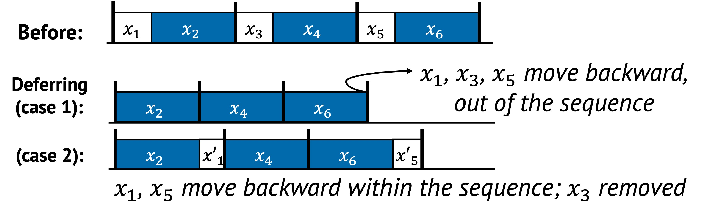

# Deferring

Deferring is a technique where tasks are intentionally postponed to a later
time.
Unlike precomputing, which executes work early, deferring takes the opposite
approach: it delays execution to reduce contention on the performance-critical
path or to wait for more favorable conditions.

## 1. Definition with Visual Example

Deferring typically applies in two forms:

- **Moving tasks out of the sequence**, so they are executed after the main critical path is finished
- **Reordering tasks later within the sequence**, allowing the system to delay work until it becomes cheaper or more informed

  

In the figure above:

- In the second row, $x_1$, $x_3$, and $x_5$ are completely deferred and removed from the critical path ($S_n$). The remaining sequence becomes shorter and faster to execute.
- In the third row, those same tasks are deferred within the sequence and become $x'_1$ and $x'_5$, indicating they are executed later when they may be cheaper, better informed, or even unnecessary ($x_3$).

Both forms reduce the immediate workload in $S_n$ and allow the system to prioritize latency-sensitive execution.

## 2. Underlying Principles

Deferring primarily uses:

- **Removal**: Tasks are taken out of the performance-critical sequence
- **Reordering**: Tasks are delayed within the sequence to a more favorable point

Unlike precomputing, which speculates early usefulness, deferring speculates that later execution will be cheaper, smarter, or possibly avoidable.

## 3. Conditions for Deferring

Deferring is effective when:

- A task is not immediately required to preserve correctness
- Postponement leads to more efficient execution or more informed decisions
- There is a chance the task will become unnecessary

A common condition is:

$$
\text{len}(S_{\text{before}}) > \text{len}(S_{\text{after}}) \quad \text{or} \quad F(x_1, x_2) > F(x_2, x_1)
$$

This means deferring $x_1$ to after $x_2$ leads to a better overall runtime.

## 4. When to Apply

We identify three typical strategies for applying deferring in real systems.

### Prioritize the Performance-Sensitive Sequence

In some cases, tasks are delayed simply to avoid slowing down the main path.
They are deferred to execute lazily after the critical sequence $S_n$ is finished, even if that means sacrificing some responsiveness later.

For example, a system may delay data durability checks or index updates until
after the user-visible response is sent. This prioritizes fast response at the
cost of later performance.

### Wait for Better Information

Deferring can be beneficial when a task can make a better decision later, with more complete or up-to-date context.

For example, a scheduler might defer assigning a task to a worker until more information about resource availability is available.
This leads to better placement decisions and reduces the chance of needing to undo or reassign work.

### Skip Work That May Become Unnecessary

Sometimes, a task may turn out to be irrelevant or unnecessary.
Deferring gives the system a chance to observe whether the task still matters later — and skip it entirely if not.

For example, optimistic concurrency control defers the cost of managing locks until the moment a conflict actually occurs.
This lazy approach assumes most transactions will not conflict and avoids lock overhead unless truly required.
If no conflict arises, the system skips the entire concurrency resolution step, saving work.

## 5. Examples from Real Systems

| System | Description |
|--------|-------------|
| [Sparrow (SOSP'13)](https://dl.acm.org/doi/10.1145/2517349.2522716) | Delay assignment of tasks to worker machine until workers are prepared, mitigating race conditions among multiple distributed schedulers. |
| [PACTree (SOSP'21)](https://dl.acm.org/doi/10.1145/3477132.3483589) | With optimistic version lock, perform an operation optimistically without holding a lock and then check the version number. |
| [SKYROS (SOSP'21)](https://dl.acm.org/doi/10.1145/3477132.3483566) | Defer expensive ordering and operation execution until their effects are externalized. |

## Additional Notes

- Deferring is often paired with **batching**, since delayed tasks can be grouped and handled more efficiently later
- It reduces pressure on the critical path but can increase tail latency if not carefully managed

---
Up next: [Relaxation →](./relaxation.md)
