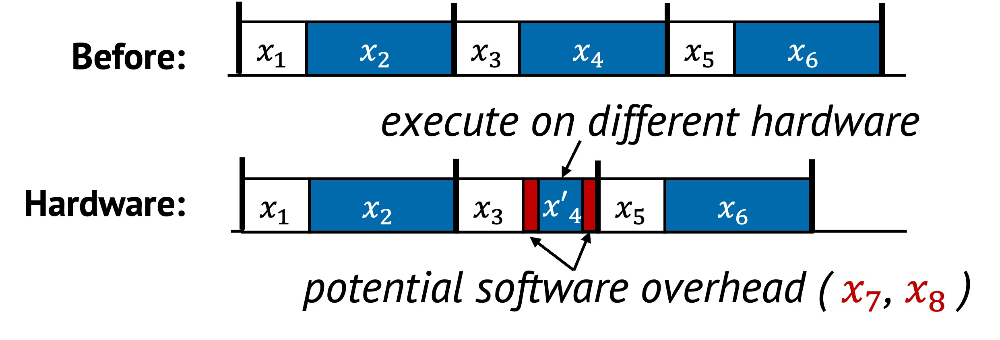

# Hardware Specialization

Hardware specialization improves performance by deciding where a task should
execute. In some cases, this means offloading work to dedicated hardware such
as NICs, FPGAs, or accelerators. In other cases, the system improves efficiency
by selecting the right CPU core, socket, NUMA node, or memory domain for
execution.

Both strategies aim to reduce contention, latency, and resource interference by
aligning each task with the most suitable hardware environment.

## 1. Definition with Visual Example

Specialization does not change what the task does, but optimizes how and where
it is performed. This can include moving the task outside the main CPU or
placing it on a more appropriate part of the CPU complex.

  

In the original sequence, all tasks $x_1$ to $x_6$ are handled uniformly by the
CPU. In the optimized version, tasks $x_4$ is assigned to specialized hardware
or localities, and executed more efficiently. Additional coordination tasks
$x_7$ and $x_8$ are added to manage this transfer, such as initiating a DMA,
queueing a NIC operation, or selecting the proper socket.

These changes shorten the critical path by delegating expensive or
interference-prone work to better-suited components.

## 2. Underlying Principles

Hardware specialization typically uses:

- **Replacement**: Assign a task to a different hardware unit that performs the
same logic more efficiently

The system leverages hardware layout, capabilities and locality to restructure
execution for better efficiency.

## 3. Conditions for Hardware Specialization

Hardware specialization is effective when:

- A task’s cost is high on the general-purpose path
- An alternative hardware location can perform it faster or with less interference
- The overhead of setup and coordination does not outweigh the benefit

This can be described as:

$$
F(x_4) > F(x_7) + F(x_4') + F(x_8)
$$

Where:
- $x_4'$ is the specialized executions of the original tasks
- $x_7$ and $x_8$ represent coordination overhead

The goal is to reduce overall cost by executing work on a more appropriate
hardware resource.

## 4. When to Apply

There are two common strategies for hardware specialization.

### Offloading to Dedicated Hardware

Tasks such as encryption, packet I/O, or compression can be moved to devices
like NICs or SmartNICs, FPGAs, or accelerators. This allows the CPU to focus on
serial bottlenecks while parallel or offload-friendly work is handled elsewhere.

For example:
- Packet processing can be pushed to a programmable NIC
- Storage or network checksums can be handled by an accelerator

### Choosing the Right CPU Locality

Even without offloading to devices outside the CPU, choosing where a task runs
within the CPU complex affects performance. Placement across CPU cores,
sockets, and NUMA nodes can significantly impact access latency and resource
contention.

For example:
- Assigning a thread to the same socket and core as its data reduces access delay
- Grouping cooperating threads on the same NUMA node improves memory locality
- Placing memory close to the execution core avoids unnecessary interconnect traffic

These decisions optimize performance by exploiting the system’s topology.

## 5. Examples from Real Systems

| System | Description |
|--------|-------------|
| [Nap (OSDI'21)](https://www.usenix.org/conference/osdi21/presentation/wang-qing) | Introduce NUMA-aware layer over existing persistent memory (PM) indexes to manage hot items and avoid costly remote PM access. |
| [FAERY (OSDI'22)](https://www.usenix.org/conference/osdi22/presentation/zeng) | Adopt FPGA to accelerate embedding-based retrieval system which requires both high memory bandwidth and pipeline parallelism. |
| [KV-Direct (SOSP'17)](https://dl.acm.org/doi/10.1145/3132747.3132756) | Use programmable NICs to extend RDMA primitives and directly handle key-value operations in the host memory. |

## Additional Notes

- Incorrect placement (e.g., cross-socket or oversubscribed devices) can degrade performance
- Fine-grained offloading may incur coordination costs that outweigh its benefit

Up next: [Layering →](./layering.md)
