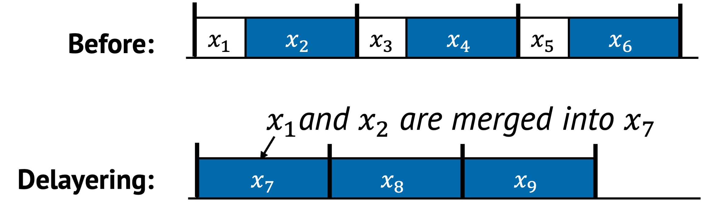
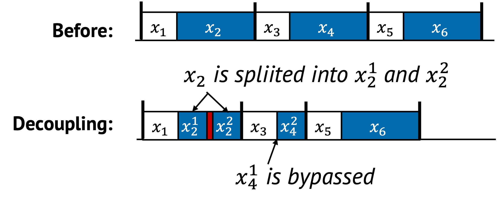

# Layering

A layer is a logical division or abstraction defined during system design to
organize and structure a system’s components.  Each layer encapsulates a
specific set of functionalities or services, helping to modularize the system
and making it easier to understand, maintain, and scale.  While layers provide
clear structural benefits, they also introduce performance overhead, stemming
from additional processing, communication, or indirection across layers.

Layering, the final methodology, optimizes sequential performance by reducing
the overhead associated with layers. This methodology includes three distinct
strategies:

- **Bypassing**: Selectively skip an entire layer.
- **Delayering**: Collapse or flatten layers to avoid software overhead between them.
- **Decoupling**: Split entangled responsibilities so they can execute independently.

## 1. Definition with Visual Example

Each of the three techniques is illustrated below.

### Bypassing

  

Bypassing skips intermediate layers in the system stack.
In the example above, the original execution requires tasks to pass through multiple layers in a fixed sequence.
After bypassing, $x_4$ is skipped entirely, reducing overall runtime.
Bypassing is appropriate when the intermediate layer provides no essential functionality for a given workload or use case.

### Delayering

  

Delayering collapses multiple logically separate layers into a single composite layer.
In the example above, $x_1$ and $x_2$ were originally independent layers.
After delayering, they are merged into a single combined layer $x_7$.

This strategy removes the overhead of calling, transitioning, or managing state between layers.
It is especially useful when the boundaries exist for modularity but do not justify runtime cost.

### Decoupling

  

Decoupling splits a tightly bound layer into finer-grained sublayers.
In the example, $x_2$ is decomposed into $x^2_1$ and $x^2_2$, and $x_4$ into $x^4_1$ and $x^4_2$.

- $x^2_1$ and $x^2_2$ now include some additional overhead between them, but make internal structure explicit.
- Likewise, $x^4_1$ and $x^4_2$ are fully decoupled, allowing the system to skip $x^4_1$ when it is unnecessary and run only $x^4_2$.

This unlocks conditional execution and potential parallelism, improving flexibility and efficiency.

## 2. Underlying Principles

Layering uses structural change to improve efficiency, typically applying:

- **Removal**: Eliminates unnecessary layers or transitions across layers
- **Replacement**: Merge or reroute functionality through optimized paths
- **Reordering**:Decouple previously entangled components so they can execute independently and, if beneficial, in a different order

## 3. Conditions for Layering

Layering is effective when the system structure introduces avoidable overhead
due to unnecessary transitions, tightly coupled responsibilities, or
over-modularized logic. The following are the conditions under which each
strategy applies best.

### Bypassing

Bypassing is useful when layers introduce overhead without adding critical logic
for a given execution path. It involves creating shortcuts or fast-paths that
skip standard interfaces or kernel layers.

Common signs that bypassing may help:

- A task path repeatedly passes through a layer that does not modify or inspect the data
- Context switching between user and kernel space introduces measurable cost
- The layer enforces generic policies that do not apply in the current runtime

For example:

- Bypassing the kernel stack to handle I/O directly in user space
- User-level network stacks or storage paths that avoid VFS
- Fast-path handlers that shortcut past validation or indirection layers
- Skipping internal service layers that enforce static routing or transformation

These allow performance-critical tasks to operate with minimal indirection.

### Delayering

Delayering is helpful when adjacent layers contribute to overhead through
repeated validation, data marshaling, or control transitions. Rather than
skipping layers, delayering merges two or more layers into one unified
execution path, reducing the cost of transitions between them.

This is effective when:

- Crossing layers incurs non-trivial costs like data copying, permission checks, or synchronization
- Separate layers each add minimal logic but together cause significant cumulative delay
- Layer boundaries serve modularity or reusability, but not correctness

Delayering moves away from modularity in favor of performance.
It often trades off generality, flexibility, or functionality to reduce execution time or increase throughput.

### Decoupling

Decoupling applies when a single layer handles multiple roles that interfere
with one another, or when unnecessary serialization exists.
Splitting these responsibilities improves flexibility and can reduce overall latency.

You might apply decoupling when:

- A fast-path is blocked by slow-path operations in the same control flow
- Background tasks are serialized with latency-sensitive ones
- There are opportunities to run some parts conditionally or in parallel

For example:

- Splitting indexing from value storage in a key-value store
- Separating metadata updates from data writes so each can proceed independently
- Allowing parts of the logic (e.g., validation, logging) to be skipped when not needed

This enables a more adaptive and performant system by breaking apart tightly coupled logic.

## 4. Examples from Real Systems

| System | Description |
|--------|-------------|
|[nanoPU (OSDI'21)](https://www.usenix.org/conference/osdi21/presentation/ibanez) | Route incoming messages directly to the running threads’ registers, bypassing traditional memory hierarchies. |
|[TinyNF (OSDI'20)](https://www.usenix.org/conference/osdi20/presentation/pirelli) | Simplify buffer management layers by removing buffer pool. Merge reception, processing and transmission into a single logical flow. |
|[RackSched (OSDI'20)](https://www.usenix.org/conference/osdi20/presentation/zhu) | Two-layer scheduling framework decouples inter-server scheduling in top-of-rack switch and intra-server scheduling in each server.|

## Additional Notes

- While both delayering and bypassing aim to reduce the number of layers being
executed, their approaches differ. Delayering restructures the system
architecture itself to have fewer layers, thereby simplifying the system. In
contrast, bypassing selectively skips over existing layers without modifying
the underlying architecture. The skipped layers remain present and may still
be executed in other contexts.

- Decoupling separates tightly integrated components into finer-grained
subtasks, enhancing modularity and flexibility. This separation facilitates
a more targeted optimization of individual components. Often, specialization
tailored for specific hardware configurations or software requirements
necessitates initial decoupling of integrated mechanisms. This ensures that
modifications are minimal and do not inadvertently impact any other system
components. For example, Akkio[^akkio] introduces an intermediary layer between
client applications and the datastore systems to separate the allocation of
shard data from its management. Consequently, this allows application to
specify their own shard sizes much smaller than existing one, and determines
the distribution of data across shards, facilitating customized shard
assignment tailored to the needs of each application.

- Decoupling can enable more effective caching opportunities, especially when only a
subset of a task’s output is reused over time. For instance, Tsai et al.
[^tsai] first decouple permission checking from directory lookup, allowing
permission results to be cached and reused independently, creating a fast
path for common operations.

[^akkio]: M. Annamalai, K. Ravichandran, H. Srinivas, I. Zinkovsky, L. Pan, T.
  Savor, D. Nagle, and M. Stumm. Sharding the Shards: Managing Datastore
  Locality at Scale with Akkio. In 13th USENIX Symposium on Operating Systems
  Design and Implementation (OSDI 18), pages 445–460, 2018. ISBN
  978-1-939133-08-3.

[^tsai]: C.-C. Tsai, Y. Zhan, J. Reddy, Y. Jiao, T. Zhang, and D. E. Porter. How
  to get more value from your file system directory cache. In Proceedings of the
  25th Symposium on Operating Systems Principles, SOSP ’15, pages 441–456, New
  York, NY, USA, Oct. 2015. Association for Computing Machinery. ISBN
  978-1-4503-3834-9. doi: 10.1145/2815400.2815405.
