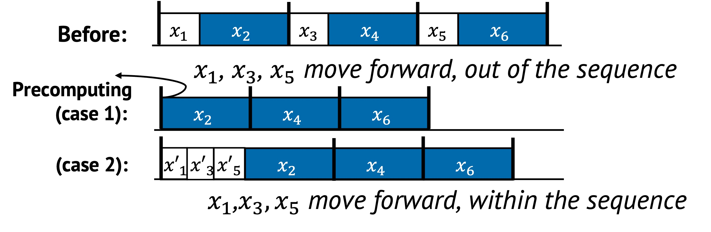

# Precomputing

Precomputing is a technique where certain tasks are executed before they are
strictly needed. By moving work earlier in time, the system can reduce latency
during performance-critical execution paths.

Instead of waiting until a task is required at runtime, the system anticipates
that it will be needed and performs it in advance. This reduces the workload
during peak times and allows smoother execution when the result is actually
used.

## 1. Definition with Visual Example

Precomputing involves moving tasks earlier in time to reduce their runtime
impact. There are two common forms:

- Moving tasks completely outside the sequence (to eliminate their cost from the critical path)
- Reordering tasks within the sequence (to improve locality or overlap with other work)

    

In the figure above:

- In the **second row**, tasks $x_1$, $x_3$, and $x_5$ are precomputed **before the epoch starts**. These are executed ahead of time, and do not block the main path anymore. This reduces critical path length by removing predictable work.
- In the **third row**, $x_1$, $x_3$, and $x_5$ are **moved earlier within the sequence** and replaced with $x'_1$, $x'_3$, and $x'_5$. These earlier positions allow the system to better exploit data locality or reduce contention (e.g., loading data while the system is otherwise idle).

Both techniques reduce the perceived latency of the epoch. The first strategy focuses on eliminating runtime cost, while the second aims to improve execution efficiency by changing timing within the same sequence.

## 2. Underlying Principles

Precomputing primarily uses the following principles:

- **Removal**: Tasks are taken off the critical path and handled in advance
- **Reordering**: Task execution is shifted to an earlier point in time

## 3. Conditions for Precomputing

Precomputing is effective under the following conditions:

$$
\text{len}(S_{\text{before}}) > \text{len}(S_{\text{after}}) \quad \text{or} \quad F(x_1, x_2) > F(x_2, x_1)
$$

This means either:
- Moving tasks out of the sequence reduces the total number of tasks
- Reordering tasks leads to more efficient execution

Additionally, the system must have:

- Tasks can be safely and meaningfully predicted
- Idle or underutilized resources are available
- The cost of early execution is lower than doing it on-demand

## 4. When to Apply

There are three common strategies for precomputing in practice:

### Moving Tasks Out of the Sequence

Some tasks can be safely executed before the main sequence begins. This is
especially useful when the system is idle or under low load.

For example, memory managers may begin garbage collection in advance when memory
pressure starts rising, rather than waiting until it reaches a critical
threshold.

### Reordering Within the Sequence

Other tasks benefit from being shifted earlier within the same sequence.
Reordering may help align with existing data in cache or reduce contention with
nearby operations.

For example, reading a hot object earlier in the pipeline can warm the cache and
reduce future misses.

### Speculation

Both strategies depend on some form of speculation.

- **Future need prediction**: The system guesses a task will be needed soon
- **Sufficient context assumption**: The system assumes that current information is sufficient to perform useful computation ahead of time

When correct, speculation saves time without adding risk.
When wrong, the system may need to re-execute or fall back to a slow path.

## 5. Examples from Real Systems

| System | Description |
|--------|-------------|
| [Duet (SOSP'15)](https://dl.acm.org/doi/10.1145/2815400.2815424) | Reorder storage maintenance to prioritize data already cached in memory. |
| [Itasks (SOSP'15)](https://dl.acm.org/doi/10.1145/2815400.2815407) | Proactively trigger memory reclaiming upon detecting the first sign of memory pressure to reduce garbage collection during critical path. |
| [Correctables (OSDI'16)](https://www.usenix.org/conference/osdi16/technical-sessions/presentation/guerraoui) | Prefetch dependent objects based on preliminary view instead of waiting for fully consistent one to hide the latency of strong consistency. |

## Additional Notes

- Precomputing is often used together with **caching** and **relaxation**.
  The system computes results early and stores them for future reuse, as in
  caching.  At the same time, it may need to tolerate partial, outdated, or
  approximate results---this trade-off aligns with relaxation.  For example,
  speculative prefetching or early object construction may proceed with
  incomplete information, accepting that the result may not be perfect but
  still useful.
- It works best when prediction is accurate and the cost of being wrong is low
- In systems with tight correctness requirements, fallback logic may be needed to handle mispredictions

---

Up next: [Deferring →](./deferring.md)
