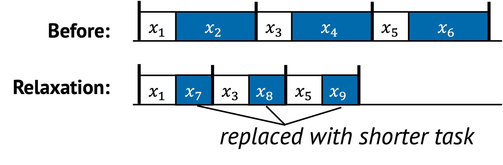

# Relaxation

Relaxation is a technique that improves performance by relaxing certain
non-functional properties of a system. Instead of strictly preserving
correctness guarantees like accuracy, consistency, or durability, the system
chooses to weaken these guarantees in exchange for better speed, lower
latency, or increased throughput.

Relaxation is especially powerful when exact correctness is not critical, or
when approximate answers are good enough for the task at hand.

## 1. Definition with Visual Example

In relaxation, some tasks are either replaced with lighter versions or skipped
entirely. This reduces the cost of execution, sometimes significantly, while
still delivering acceptable results.

  

In the example above:

- Tasks $x_2$, $x_4$, and $x_6$ are replaced with approximate versions $x_7$, $x_8$, and $x_9$
- These approximations are faster and less resource-intensive
- The full sequence becomes more efficient, but possibly less precise

The trade-off here is between performance and non-functional guarantees like
precision or reliability.

## 2. Underlying Principles

Relaxation applies two principles:

- **Replacement**: Swap heavy or strict tasks with lighter or weaker versions
- **Removal**: Skip tasks that enforce strict properties, when they are not strictly needed

## 3. Conditions for Relaxation

Relaxation is effective when:

- The system can tolerate approximation, staleness, or reduced guarantees
- Performance bottlenecks come from enforcement of strict policies
- The trade-off does not significantly harm user experience or application correctness

The common condition is:

$$
F(x_k) > F(x'_k)
$$

This means the relaxed version $x'_k$ performs the same task more cheaply, even if it sacrifices some property.

## 4. When to Apply

There are three typical scenarios where relaxation is used.

### Approximate Results Are Acceptable

In some domains, full accuracy is not necessary. Relaxed versions of a task can return approximate but usable results faster.
For example, sampling-based analytics compute estimates over a small subset of data instead of scanning everything.
This speeds up processing while keeping the result statistically meaningful.

In AI-serving systems, similar trade-offs are common.
Some frameworks allow non-deterministic scheduling or reuse of stale or
approximate results to improve throughput, even if outputs are not exactly
reproducible.

### Consistency Can Be Loosened

Relaxation often targets consistency guarantees in distributed systems.
For example, a system may serve slightly stale data to reduce the cost of coordination.
Causal consistency or eventual consistency is used instead of strong consistency to avoid blocking or waiting for global agreement.
This can significantly reduce latency in read-heavy workloads.

### Other Strong Guarantees Can Be Relaxed

Relaxation is often applied to core system guarantees such as strict
serializability, linearizability, durability, or availability. By partially
loosening these properties, systems can reduce coordination overhead, lower
latency, or increase throughput.

For example:

- A system may delay durability by buffering writes in memory, deferring persistence to improve performance.
- Strict serializability may be relaxed to allow operations to complete locally without blocking for global order.
- Availability can be prioritized by serving stale or approximate results when the most up-to-date state is unreachable.

These relaxations come with trade-offs in correctness or failure semantics, but are widely used in real-world systems when the performance benefits justify them.

## 5. Examples from Real Systems

| System | Description |
|--------|-------------|
| [KnightKing (SOSP'19)](https://dl.acm.org/doi/10.1145/3341301.3359634) | Allow for sampling the next edge in random walk algorithms without scanning all out-edges at the walker’s current vertex. |
| [RSS and RSC (SOSP'21)](https://dl.acm.org/doi/10.1145/3477132.3483566) | Relax certain real-time guarantees of strict serializability for causally unrelated transactions or operations. |
| [SAUCR (OSDI'18)](https://www.usenix.org/conference/osdi18/presentation/alagappan) | Relax durability and availability when most servers crash simultaneously to achieve performance comparable to memory-durable one. |

## Additional Notes

- Relaxation must be carefully scoped to avoid violating application correctness

Up next: [Contextualization →](./context.md)
